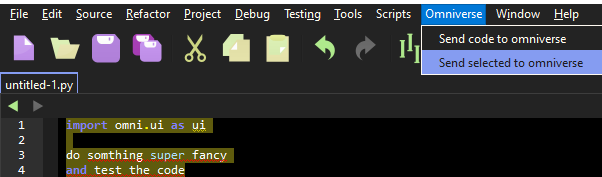
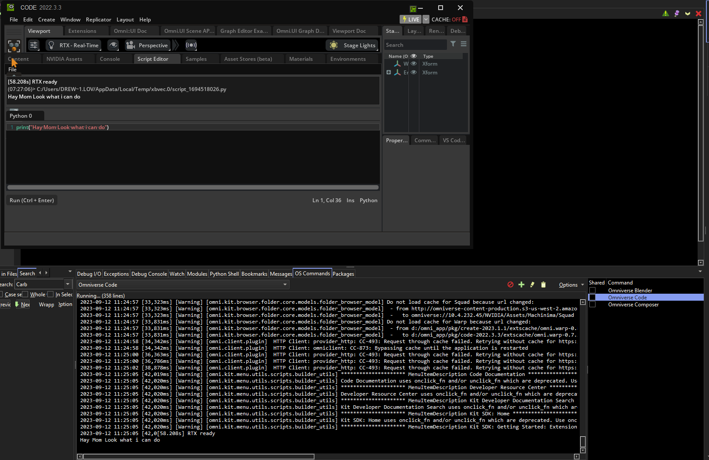

# Omniverse_Wingman
Generates a wing project for an Omniverse ext.

In the release I have added a per built auto compleate and ziped it 

if it does not work you can you can copy the templeate wing projest and the auto code and just go from there

# What Can It Do
1. Give you code compleation. Along with source assistanat

2. Attach the debugger and debug the code just like stuido code. just by importing wingdbstub from your ext or other. (Wing Pro only as far as i know)

3. Add the Wingman Copilot omniverse Extension and send code.

4. run code or composer right from wing command shell toolbar

### This is currenty a very (if you will) beta.
what do i mean by that.

There is very little error checking and it has not been fully tested even by me.

Im currently on a large project so i just wanted to get this up can running and curse profusely at it as I go.

so if you do test this out all feedback is welcome good or bad. please feel free to prase or ridicule me.

# Code Compleateion How Does It Work.
Once you have have a copy of this repo you will run the Project_Generator.py with the root level of your extension as the first arg. for example..

python Project_Generator.py "D:\Omni_Extensions\my-extension-supersexystuff"

Project_Generator then scan your project for all the installed extension such as

omni.kit.variant.editor-105.0.4

omni.ui-2.14.30+ed961c5c.wx64.r.cp310

within your app dir along with some others.

it will then copy that code and build a package modual base file structure.
( Hopfuly :) )
not sure if its exatly correct but so far its been a one to one

# Making Sure The Commands work.
once the Project_Generator is finished you will have a wing project file in the same dir as your config fould within your ext.

over time this will enabitly get out of date or you may want to run a differnt version other then the latest.
to change how this works open out your project settings and change the envs to the version that you want to run along with where the pkg folder of where your omniverse resides.

# Wingman Copilot.
To get this working you will edit your wing prefs and add the Wing_Scripts within the repo to our ide extension scripting search paths.

Copilot https://github.com/Mayaenite/mayaenite-tools-wingcopilot
